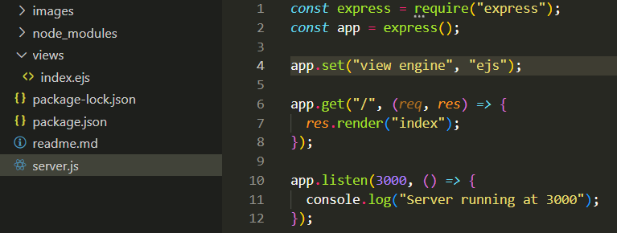
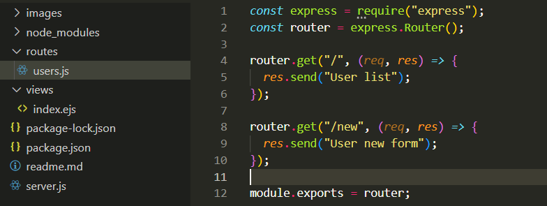
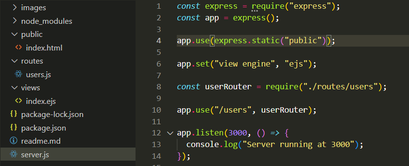
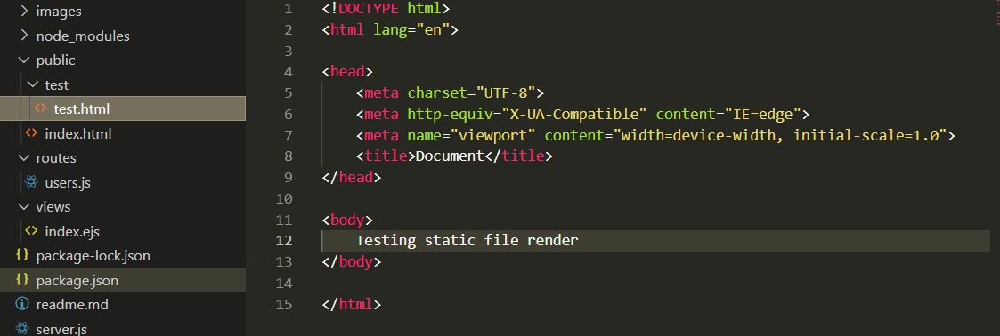
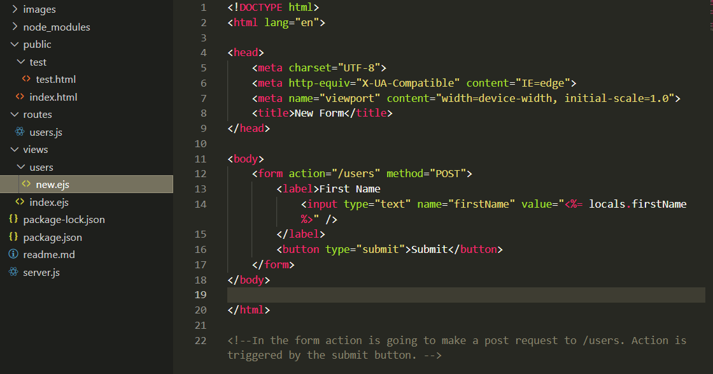
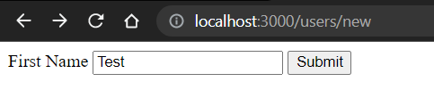
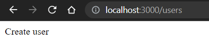

# Express

## Dependencies

- npm init -y &nbsp;&nbsp;&nbsp;&nbsp;&nbsp;&nbsp;&nbsp;&nbsp;&nbsp;&nbsp; // sets up basic package.json

- npm i express &nbsp;&nbsp;&nbsp;&nbsp;&nbsp;&nbsp;&nbsp;&nbsp;&nbsp;&nbsp; // install express as a deependency

- npm i -D nodemon &nbsp;&nbsp;&nbsp;&nbsp;&nbsp;&nbsp;&nbsp;&nbsp;&nbsp;&nbsp; // install nodemon as a dev dependency

- npm i ejs &nbsp;&nbsp;&nbsp;&nbsp;&nbsp;&nbsp;&nbsp;&nbsp;&nbsp;&nbsp; // ejs view engine install

<p>
    Next create a devStart inside package.json under scripts (replace test). The value would be nodemon server.js. Here server.js will be our server file. Create that next.
</p>

```javascript
"scripts": {
    "devStart": "nodemon server.js"
  }
```

- npm run devStart &nbsp;&nbsp;&nbsp;&nbsp;&nbsp;&nbsp;&nbsp;&nbsp;&nbsp;&nbsp; // run the server just created

---

## Server

```javascript
const express = require("express");
const app = express();

app.listen(3000);
```

- By calling express as a function in line 2, we create an application which allows us to setup our entire server.

- To make our server actually run, we do the 3rd line. The argument passed is the port number. Now the server is listening on port 3000 for any requests.

- But when you open localhost:3000 you'll see Cannot Get /

```html
Cannot GET /
```

- All that's saying is that our application doesn't have any routes setup, so when we try to get the index route, which is the '/', it's saying that it can't find that route.

- The easiest way to create a route is app.get(), app.post(), ... and pretty much any HTTP method that you can think of.

- Let's create a get() request.

```javascript
app.get("/", (req, res) => {
  res.send("Hi");
});
```

```html
Hi // client
```

- The first parameter is the path. The second parameter is a function that takes in 3 parameters. The first is a requset, second a response and third is the next function. Most of the time we don't care about the next function and not using it here.

- In the above code we creted a route at index '/' and whenever someone makes a get request to that route, we send 'Hi' to the client.

- For the most part we generally don't use send().

```javascript
app.get("/", (req, res) => {
  res.sendStatus(500);
});
```

```html
Internal Server Error // client
```

- Generally when you're sending a status you would want to send a message along with it.

```javascript
app.get("/", (req, res) => {
  res.status(500).send("Check console for error.");
});
```

```html
Check console for error. // client
```

```
Failed to load resource: the server responded with a status of 500 (Internal Server Error) // console
```

- More commonly, you would send a json along with the status code.

```javascript
app.get("/", (req, res) => {
  res.status(500).json({ message: "Error" });
});
```

```
{"message":"Error"} // client
```

- In case you want the status to be a default success, do this.

```javascript
app.get("/", (req, res) => {
  res.json({ message: "custom message" });
});
```

```
{"message":"custom message"}
```

- Send down a file to the user for download.

```javascript
app.get("/", (req, res) => {
  res.download("./server.js");
});

// Pass the filePath as argument
```

- Another thing that we can do with our response is render an HTML file. We need to tell our application where the files are which are to be rendered. By default they're in a folder called **_views_**.

<p align="center">

</p>

```
Error: No default engine was specified and no extension was provided. // client
```

- We're getting this error cause we don't have a view engine setup.

- The nice thing about using your server to output your views is that you can actually run your server code to generate the code inside your views.

- Here we're using EJS (Embedded JavaScript Templates) as our view engine.

- In order to tell our app to use the view engine, we do the following.

```javascript
app.set("view engine", "ejs");
```

```
<body>
    Hello
</body>

// index.ejs
```

```
Hello
// localhost:3000
```

- In order to pass information from server that is to be rendered in the view, we need to do the following.

```javascript
app.get("/", (req, res) => {
  res.render("index", { text: "World" });
});

// The second parameter is an object which can be anything
```

- To access the information sent by the server in our view, do the following in index.ejs

```
<body>
  Hello <%= text %>
</body>
```

```
Hello World
// localhost: 3000
```

- We can render anything in our view. Example

```
<body>
  Hello <%= 2 + 2 %>
</body>
```

```
Hello 4
// localhost: 3000
```

- Suppose we render something that's not sent by the server. This would throw an error. So in order to get around this we do the following in our view file.

```
<body>
  Hello <%= locals.text %>
</body>
```

```javascript
app.get("/", (req, res) => {
  res.render("index", { text123: "World" });
});
```

```
Hello
// localhost: 3000
```

- Optimal solution:

```javascript
app.get("/", (req, res) => {
  res.render("index", { text: "World" });
});
```

```
<body>
  Hello <%= locals.text || "Default" %>
</body>
```

- Here the if we don't send 'text' from server, 'Default' will be rendered.

---

## Routers

In the previous examples, we had all of our routes defined in the same file (server.js). Once we have hundreds if not thousands of routes, it could be difficult to deal with from one single file.

A **router** is essentially a way for you to create another instance of your application that is its own little mini application, which has its own logic applied to it which we can then insert to the main application.

Creating routers:

- Create a folder **_routes_**

- Creating a file **_users.js_** inside the routes folder which will contain all the '/user' routes.

<p align="center"></p>

```javascript
// server.js

const express = require("express");
const app = express();

app.set("view engine", "ejs");

app.get("/", (req, res) => {
  res.render("index", { text: "World" });
});

const userRouter = require("./routes/users");

app.use("/users", userRouter);

app.listen(3000, () => {
  console.log("Server running at 3000");
});
```

Explanation: All of our routes in users.js will start from /users. Hence we're applying that in server.js instead of writing /users everytime for each user route. So, '/' in users.js means '/users'.

In order to get a particular user, we have to create a generic route which can be done like this.

```javascript
router.get("/:id", (req, res) => {
  res.send(`Get user ${req.params.id}`);
});
```

Whatever you write after **:**, (id here) will be after req.params. Hence the req.params.id

users.js:

```javascript
const express = require("express");
const router = express.Router();

router.get("/", (req, res) => {
  res.send("User list");
});

router.get("/new", (req, res) => {
  res.send("User new form");
});

// Creating new user
router.post("/", (req, res) => {
  res.send("Create user");
});

router.get("/:id", (req, res) => {
  res.send(`Get user ${req.params.id}`);
});

module.exports = router;
```

An important thing to note here is that whenever we have dynamic routes, they should be put after mentioning all the static routes. This is because express works from top to bottom. So incase of "/:id", the "/new" will be considered an id if put after dynamic route.

```javascript
const express = require("express");
const router = express.Router();

router.get("/", (req, res) => {
  res.send("User list");
});

// Creating new user
router.post("/", (req, res) => {
  res.send("Create user");
});

router.get("/:id", (req, res) => {
  res.send(`Get user ${req.params.id}`);
});

router.get("/new", (req, res) => {
  res.send("User new form");
});

module.exports = router;
```

```
Get user new
// localhost:3000/users/new
```

Another important thing to note is that it compares get with get only and not with post requests. So if we have a **_post_** request for "/users/new" after the dynamic route of **_get_** for "/:id", post would work as expected.

Generally when we create get user, we're going to be creating put and delete requests along with it.

```javascript
router.get("/:id", (req, res) => {
  res.send(`Get user ${req.params.id}`);
});

router.put("/:id", (req, res) => {
  res.send(`Update user ${req.params.id}`);
});

router.delete("/:id", (req, res) => {
  res.send(`Delete user ${req.params.id}`);
});
```

You'll notice that these three routes are exactly the same. They have the same path. The only difference is their type. One's a get, one's a put and other a delete. We can change these three routes together to simplify things using **_router.route_**.

```javascript
router
  .route("/:id")
  .get((req, res) => {
    res.send(`Get user ${req.params.id}`);
  })
  .put((req, res) => {
    res.send(`Update user ${req.params.id}`);
  })
  .delete((req, res) => {
    res.send(`Delete user ${req.params.id}`);
  });
```

---

## router.param()

The router.param() is going to run a function anytime it finds a param that matches the name you pass to it.

```javascript
router.param("id", (req, res, next, id) => {
  console.log(id);
  next();
});
```

The first parameter is the param that needs to be matched, the second parameter is the function that's going to run whenever there's a match in the param. The function takes in 4 parameters: req, res, next and the value of the param.

Significance of next(): Whenever the router.param finds a param that matches the thing passed to it, a function is executed. But it doesn;t run any other code unless we call the next().

The next() basically means when it's called, run the next thing in line.

param in router.param is a **_middleware_**.

Middleware is stuff that runs between the request being sent to your server and the actual response being returned to the user.

Hence the router.route having all the requests actually runs after the middleware.

```javascript
router
  .route("/:id")
  .get((req, res) => {
    console.log(req.user);
    res.send(`Get user ${req.params.id}`);
  })
  .put((req, res) => {
    res.send(`Update user ${req.params.id}`);
  })
  .delete((req, res) => {
    res.send(`Delete user ${req.params.id}`);
  });

const users = [{ name: "Kyle" }, { name: "Sally" }];
router.param("id", (req, res, next, id) => {
  req.user = users[id];
  next();
});
```

```
console: { name: 'Sally' }
// localhost:3000/users/1
```

---

## Creating a middleware for logging out information

```javascript
// server.js

const express = require("express");
const app = express();

app.set("view engine", "ejs");
app.use(logger);

app.get("/", (req, res) => {
  res.render("index", { text: "World" });
});

const userRouter = require("./routes/users");

app.use("/users", userRouter);

function logger(req, res, next) {
  console.log(req.originalUrl);
  next();
}

app.listen(3000, () => {
  console.log("Server running at 3000");
});
```

Putting the use(logger) at the top since we want the url to be logged out for each and every request. Express works from top to bottom.

Suppose we want the logger function to work only on a particular route, we could do something like this.

```javascript
app.get("/", logger, (req, res) => {
  res.render("index", { text: "World" });
});
```

Note: we do not use app.use(logger) if we want to do the above for a particualr route.

We can have n number of middleware for a praticular route.

```javascript
app.get("/", logger, logger, logger, (req, res) => {
  res.render("index", { text: "World" });
});
```

The n number of middleware run in order in which they're sent.

---

## Rendering static files

Create a folder public and inside it index.html

<p align="center"></p>

```
// index.html

<body>
    Hello World Static HTML
</body>
```

express.static is a middleware.

<p align="center"></p>

```
// localhost:3000/test/test.html
Hello World Static HTML
```

All the css and js from client side will go into the public folder.

---

## Parsing Form / JSON Data

```javascript
// users.js

const express = require("express");
const router = express.Router();

router.get("/", (req, res) => {
  res.send("User list");
});

router.get("/new", (req, res) => {
  res.render("users/new", { firstName: "Test" });
});

// Creating new user
router.post("/", (req, res) => {
  res.send("Create user");
});

router
  .route("/:id")
  .get((req, res) => {
    console.log(req.user);
    res.send(`Get user ${req.params.id}`);
  })
  .put((req, res) => {
    res.send(`Update user ${req.params.id}`);
  })
  .delete((req, res) => {
    res.send(`Delete user ${req.params.id}`);
  });

const users = [{ name: "Kyle" }, { name: "Sally" }];
router.param("id", (req, res, next, id) => {
  req.user = users[id];
  next();
});

module.exports = router;
```

<p align="center"></p>
<p align="center"></p>

On clicking the submit button:

<p align="center"></p>

That is the post request that we have in users.js

Instead of displaying Create user, we would like to obtain the user passed from front end. Follow the following steps.

```javascript
// Creating new user
router.post("/", (req, res) => {
  res.send(req.body.firstName);
});

// firstName was the name given in input in the new.ejs file.
```

```
TypeError: Cannot read properties of undefined (reading 'firstName')
// after clicking submit
```

We're getting this error since by default express doesn't allow us to access the body (req.body). We've to use a middleware to do that for us.

```javascript
// server.js

app.use(express.urlencoded({ extended: true }));
```

False sets the **_extended_** option of the **_urlencoded_** middleware to **_false_**. If extended is set to false, the values of the **_body_** object will contain strings or arraay of strings.

True sets the **_extended_** option of the **_urlencoded_** middleware to **_true_**. If extended is set to true, the values of the **_body_** object will contain arraay of strings.

In general it is recommended to set **_extended_** to **_true_** if you expect to receive complex data structures in the URL-encoded format, and to **_false_** if you only expect simple key-value pairs.

```javascript
// users.js

const express = require("express");
const router = express.Router();
const users = [{ name: "Kyle" }, { name: "Sally" }];

router.get("/", (req, res) => {
  res.send("User list");
});

// users/new here is the new.ejs inside users folder as shown in image above
router.get("/new", (req, res) => {
  res.render("users/new", { firstName: "Test" });
});

// Creating new user
router.post("/", (req, res) => {
  const isValid = true;
  if (isValid) {
    users.push({ name: req.body.firstName });
    res.redirect(`/users/${users.length - 1}`);
  } else {
    console.log("Unable to create user");
    res.render("users/new", { firstName: req.body.firstName });
  }
});

router
  .route("/:id")
  .get((req, res) => {
    console.log(req.user);
    res.send(`Get user ${req.params.id}`);
  })
  .put((req, res) => {
    res.send(`Update user ${req.params.id}`);
  })
  .delete((req, res) => {
    res.send(`Delete user ${req.params.id}`);
  });

router.param("id", (req, res, next, id) => {
  req.user = users[id];
  next();
});

module.exports = router;
```

In the above code if isValid is true, we'll create a user by pushing it to the users array and then redirect the user to the route "/:id". If isValid is false, we re-render the form where the form is pre-filled with the values that the user had earlier passed.

When you're posting json information to your server.

```javascript
app.use(express.json());
```

This does the same thing as express.urlencoded but for json.

Suppose you want to access query parameter of the url.

```javascript
// users.js

router.get("/", (req, res) => {
  console.log(req.query.name);
  res.send("User list");
});
```

```
localhost:3000/users?name=John
console: John
```

---

## HTTP Status Codes

<p>They're a way for the server to communicate with the browser in a structured way so that both parties know exactly what's going on.</p>

### 2xx (Success)

- 200 OK
- 201 Created: When you create something using an api(post request) you would want to return this code.
- 204 No Content: Suppose you have a delete request. In this case you don't have to return anything. In this case 204 should be used.

### 3xx (Redirection)

- 304 Not Modified : When you're calling an API, suppose no new change is there since the last time you fetched. In this case server will return 304. This saves bandwidth as you'll not download everytime and pull it from cache when no new change is there.

### 4xx Client Error

- 400 Bad Request: This is sent when you know something is bad but don't exactly know what's bad.
- 401 Unauthorized: You're trying to access something that needs some kind of authentication. This is the server's way of saying I don't know who you are.
- 403 Forbidden: When you're authorized but not authorized for certain information. This is the server's way of saying I know who you are and therefore I know you don't have access to this information.
- 404 Not Found: When you try to access something that doesn't exist.
- 409 Conflict

### 5xx Server Error

- 500 Internal Server Error: This basically says something broke in the server. 500 ensures the person using the api that what they're sending is not wrong but something is wrong from server side.

---
