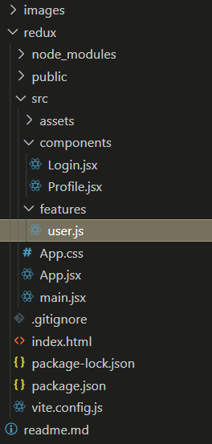
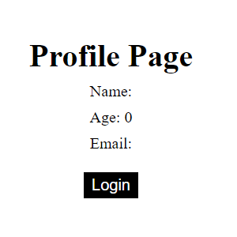
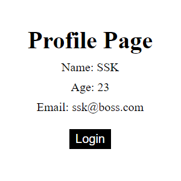
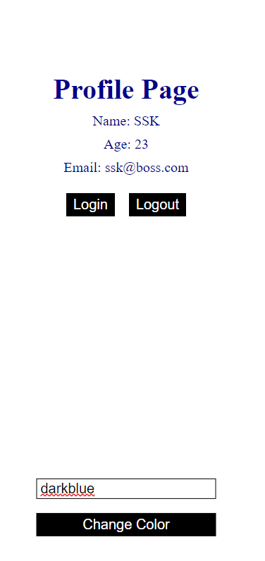

# Redux

Redux is a javascript state management library.

## Dependencies

- npm i redux react-redux @reduxjs/toolkit

---

## Store

A store in redux is a place where you're going to hold all the states that you wanna make global. Basically all the states that you wanna access throughout the application.

In redux the store is created in the main.jsx / index.jsx file.

```javascript
const store = configureStore({
  reducer: {},
});
```

To the configureStore, we pass in a `collection of reducers`.

The store in redux should contain all of the reducers that might be used in the application.

```javascript
// main.jsx

import React from "react";
import ReactDOM from "react-dom/client";
import App from "./App";
import { configureStore } from "@reduxjs/toolkit";
import { Provider } from "react-redux";

const store = configureStore({
  reducer: {},
});

ReactDOM.createRoot(document.getElementById("root")).render(
  <React.StrictMode>
    <Provider store={store}>
      <App />
    </Provider>
  </React.StrictMode>
);
```

`Reducer`: A reducer is a function that takes in some information about the current state (the previous state value, action that you want to perform on that state) and it returns back the new value of the state. We're going to have reducers for all the different states that we wanna have in our application, in order to manage them throughout the application.

Note: Right now we've not passed any reducers, we'll be passing them later in the article.

`Provider`: It is used to determine which components should have access to the redux store.

Here it'll be everything inside `App.jsx`.

The provider has an attribute of store wherein we pass our redux store.

---

Next create a folder called features inside src folder. Inside the features folder create a file user.js

```javascript
// main.jsx

import React from "react";
import ReactDOM from "react-dom/client";
import App from "./App";
import { configureStore } from "@reduxjs/toolkit";
import { Provider } from "react-redux";
import userReducer from "./features/user";

const store = configureStore({
  reducer: {
    user: userReducer,
  },
});

ReactDOM.createRoot(document.getElementById("root")).render(
  <React.StrictMode>
    <Provider store={store}>
      <App />
    </Provider>
  </React.StrictMode>
);
```

```javascript
// user.js

import { createSlice } from "@reduxjs/toolkit";

export const userSlice = createSlice({
  name: "user",
  initialState: { value: { name: "", age: 0, email: "" } },
  reducers: {
    login: (state, action) => {
      state.value = action.payload;
    },
  },
});

export default userSlice.reducer;
```

`createSlice`: It allows us to create our reducer in a very easy way. It becomes easier for us to split our logic and be able to access it throughout the application (whole point of using redux).

Inside the createSlice we're going to pass all the information about the reducer, the action that we're going to take on that state and the actual name of the state.

<p align="center"></p>

---

`useSelector` hook is used to capture the state stored in the redux store and. The state value can then be displayed in a particular component.

```javascript
// main.jsx

import React from "react";
import ReactDOM from "react-dom/client";
import App from "./App";
import { configureStore } from "@reduxjs/toolkit";
import { Provider } from "react-redux";
import userReducer from "./features/user";

const store = configureStore({
  reducer: {
    user: userReducer,
  },
});

ReactDOM.createRoot(document.getElementById("root")).render(
  <React.StrictMode>
    <Provider store={store}>
      <App />
    </Provider>
  </React.StrictMode>
);
```

```javascript
// App.jsx

import "./App.css";
import Profile from "./components/Profile";
import Login from "./components/Login";

const App = () => {
  return (
    <div className="App">
      <Profile />
      <Login />
    </div>
  );
};

export default App;
```

```javascript
// /components/Profile.jsx

import React from "react";
import { useSelector } from "react-redux";

const Profile = () => {
  const user = useSelector((state) => state.user.value);
  return (
    <div className="profile">
      <h1>Profile Page</h1>
      <p>Name: {user.name}</p>
      <p>Age: {user.age}</p>
      <p>Email: {user.email}</p>
    </div>
  );
};

export default Profile;
```

We're using `state.user.value` since in features/user.js because we've set initialState to be as shown below.

```javascript
// /features/user.js

import { createSlice } from "@reduxjs/toolkit";

export const userSlice = createSlice({
  name: "user",
  initialState: { value: { name: "", age: 0, email: "" } },
  reducers: {
    login: (state, action) => {
      state.value = action.payload;
    },
  },
});

export default userSlice.reducer;
```

<p align="center"></p>

By this point we've created redux store and we're able to access the states in the desired components. Next we would like to be able to manipulate those states. For that we need access to the functions changing the state `(actions)` in the component where we would like to change the state.

`useDispatch` hook is used to modify values of our states in redux.
`useSelector` hook is used to accessing values of our states in redux.

```javascript
// /components/Login.jsx

import React from "react";
import { useDispatch } from "react-redux";
import { login } from "../features/user";

const Login = () => {
  const dispatch = useDispatch();
  function handleClick() {
    dispatch(login({ name: "SSK", age: 23, email: "ssk@boss.com" }));
  }
  return (
    <div className="login">
      <button onClick={handleClick}>Login</button>
    </div>
  );
};

export default Login;
```

`login` is the action we're importing. The action basically sets the state value to be whatever the payload is as shown in the code below. Hence once the login button is clicked, the state value changes. The value that's being hardcoded here (name: "SSK"...) is the payload here.

```javascript
// /features/user/js

import { createSlice } from "@reduxjs/toolkit";

export const userSlice = createSlice({
  name: "user",
  initialState: { value: { name: "", age: 0, email: "" } },
  reducers: {
    login: (state, action) => {
      state.value = action.payload;
    },
  },
});

export const { login } = userSlice.actions;

export default userSlice.reducer;
```

<p align="center">
    <span align="left"></span>
    <span align="right"></span>
</p>

---

## Adding Multiple Actions

```javascript
// /features/user.js

import { createSlice } from "@reduxjs/toolkit";

const initialState = { name: "", age: 0, email: "" };

export const userSlice = createSlice({
  name: "user",
  initialState: { value: initialState },
  reducers: {
    login: (state, action) => {
      state.value = action.payload;
    },
    logout: (state) => {
      state.value = initialState;
    },
  },
});

export const { login, logout } = userSlice.actions;

export default userSlice.reducer;
```

Adding the logout action which basically sets the state value to be equal to the initialState.

```javascript
// /components/Login.jsx

import React from "react";
import { useDispatch } from "react-redux";
import { login, logout } from "../features/user";

const Login = () => {
  const dispatch = useDispatch();
  function handleLogin() {
    dispatch(login({ name: "SSK", age: 23, email: "ssk@boss.com" }));
  }

  function handleLogout() {
    dispatch(logout());
  }
  return (
    <div className="login">
      <button onClick={handleLogin}>Login</button>
      <button onClick={handleLogout}>Logout</button>
    </div>
  );
};

export default Login;
```

```javascript
// /components/Profile.jsx

import React from "react";
import { useSelector } from "react-redux";

const Profile = () => {
  const user = useSelector((state) => state.user.value);
  return (
    <div className="profile">
      <h1>Profile Page</h1>
      <p>Name: {user.name}</p>
      <p>Age: {user.age}</p>
      <p>Email: {user.email}</p>
    </div>
  );
};

export default Profile;
```

Nothing's changed here in Profile.jsx, adding just for reference.

---

## Adding multiple reducers

Create a new component ChangeColor.jsx

```javascript
// /components/ChangeColor.jsx

import { useRef } from "react";
import { useDispatch } from "react-redux";
import { changeColor } from "../features/theme";

const ChangeColor = () => {
  const colorRef = useRef(null);
  const dispatch = useDispatch();

  function handleColorChange() {
    dispatch(changeColor(colorRef.current.value));
  }
  return (
    <div className="color">
      <input type="text" ref={colorRef} />
      <button onClick={handleColorChange}>Change Color</button>
    </div>
  );
};

export default ChangeColor;
```

Create a new feature theme.js

```javascript
// /feature/theme.js

import { createSlice } from "@reduxjs/toolkit";

const initialState = "";

export const themeSlice = createSlice({
  name: "theme",
  initialState: { value: initialState },
  reducers: {
    changeColor: (state, action) => {
      state.value = action.payload;
    },
  },
});

export const { changeColor } = themeSlice.actions;

export default themeSlice.reducer;
```

Add the new reducer to main.jsx

```javascript
// main.jsx

import React from "react";
import ReactDOM from "react-dom/client";
import App from "./App";
import { configureStore } from "@reduxjs/toolkit";
import { Provider } from "react-redux";
import userReducer from "./features/user";
import themeReducer from "./features/theme";

const store = configureStore({
  reducer: {
    user: userReducer,
    theme: themeReducer,
  },
});

ReactDOM.createRoot(document.getElementById("root")).render(
  <React.StrictMode>
    <Provider store={store}>
      <App />
    </Provider>
  </React.StrictMode>
);
```

Add the new component to App.jsx

```javascript
// App.jsx

import "./App.css";
import Profile from "./components/Profile";
import Login from "./components/Login";
import ChangeColor from "./components/ChangeColor";

const App = () => {
  return (
    <div className="App">
      <Profile />
      <Login />
      <ChangeColor />
    </div>
  );
};

export default App;
```

Add the new reducer in Profile.jsx to show theme change

```javascript
// /component/Profile.jsx

import React from "react";
import { useSelector } from "react-redux";

const Profile = () => {
  const user = useSelector((state) => state.user.value);
  const theme = useSelector((state) => state.theme.value);
  return (
    <div className="profile" style={{ color: theme }}>
      <h1>Profile Page</h1>
      <p>Name: {user.name}</p>
      <p>Age: {user.age}</p>
      <p>Email: {user.email}</p>
    </div>
  );
};

export default Profile;
```

Other files don't have any change, but here they are for your reference.

```javascript
// /component/Login.jsx

import React from "react";
import { useDispatch } from "react-redux";
import { login, logout } from "../features/user";

const Login = () => {
  const dispatch = useDispatch();
  function handleLogin() {
    dispatch(login({ name: "SSK", age: 23, email: "ssk@boss.com" }));
  }

  function handleLogout() {
    dispatch(logout());
  }
  return (
    <div className="login">
      <button onClick={handleLogin}>Login</button>
      <button onClick={handleLogout}>Logout</button>
    </div>
  );
};

export default Login;
```

```javascript
// /features/user.js

import { createSlice } from "@reduxjs/toolkit";

const initialState = { name: "", age: 0, email: "" };

export const userSlice = createSlice({
  name: "user",
  initialState: { value: initialState },
  reducers: {
    login: (state, action) => {
      state.value = action.payload;
    },
    logout: (state) => {
      state.value = initialState;
    },
  },
});

export const { login, logout } = userSlice.actions;

export default userSlice.reducer;
```

<p align="center"></p>

---
